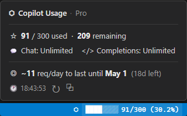
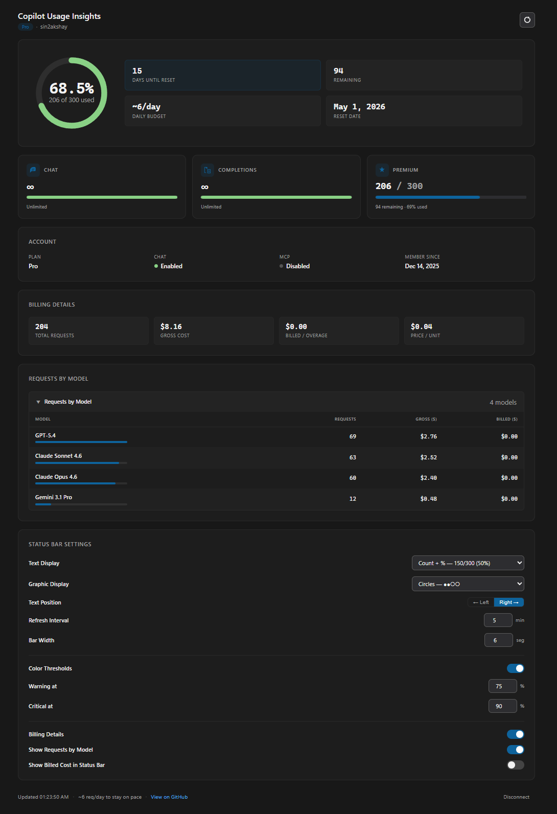

# Copilot Usage Insights

A VS Code extension that shows your GitHub Copilot premium request usage directly in the status bar — with a rich dashboard for deeper insight.

**Status bar widget and hover tooltip:**



**Full dashboard:**



## How It Works

On sign-in the extension calls the GitHub Copilot internal API (`copilot_internal/user`) — the same endpoint used by other community Copilot usage tools — to read your actual premium request quota and consumption. No local estimation, no org-level data, no guessing.

On startup the extension only attempts a silent session lookup. If no GitHub session is already available, it stays idle and waits for you to click **Sign In** or open a feature that explicitly requests access.

- **Plan detection** — your plan (Free, Pro, Pro+, Business, Enterprise) is read from the API response, not inferred from org membership.
- **Quota & usage** — exact `used / quota` numbers from GitHub, refreshed on a configurable interval.
- **Overage tracking** — if you're on a plan with paid overage, the status bar will exceed 100%.
- **Offline recovery** — if the network is unavailable the last known values are shown; the extension retries automatically every 10 seconds.

## Status Bar & Dashboard

The status bar item sits right next to the GitHub Copilot icon and updates on every refresh. Hover over it for a quick summary popup showing usage, pacing, Chat/Completions quotas, and action links.

Click the item or run **Copilot Usage Insights: Open Details** to open the full dashboard. It includes:

- **Usage gauge** — animated SVG ring showing premium request consumption with color thresholds (green / warning / critical).
- **Key stats** — days until reset, remaining requests, pacing (requests/day to stay within quota), and reset date at a glance.
- **Quota breakdown** — Chat, Completions, and Premium Interactions cards with live usage bars and remaining counts.
- **Account info** — plan type, Chat/MCP enabled status, and membership date.
- **Inline settings** — configure all status bar display options, refresh interval, bar width, and color thresholds without leaving the dashboard.
- **Pacing indicator** — shows how many requests per day you can use to stay within your monthly quota; highlights in warning color when pace is low.

The dashboard uses VS Code CSS variables throughout, so it automatically adapts to any light, dark, or high-contrast theme.

## Status Bar Display

The status bar item is positioned immediately to the left of the GitHub Copilot icon. Two independent settings control what is shown:

### Text (`statusBarTextMode`)

| Value | Example |
|---|---|
| `percent` *(default)* | `50%` |
| `count` | `150/300` |
| `countPercent` | `150/300 (50%)` |
| `remaining` | `150 left` |
| `none` | *(no text — graphic only)* |

### Graphic (`statusBarGraphicMode`)

| Value | Example |
|---|---|
| `none` *(default)* | *(no graphic — text only)* |
| `segmented` | `[■■■■□□□□]` |
| `blocks` | `████░░░░` |
| `thinBlocks` | `▰▰▰▰▱▱▱▱` |
| `dots` | `••••····` |
| `circles` | `●●●●○○○○` |

You can combine any text mode with any graphic mode. The **Text Position** toggle (`left` / `right`) controls which side of the graphic the text appears on.

**Examples:**

| Text | Graphic | Position | Result |
|---|---|---|---|
| `percent` | `blocks` | `left` | `50% ████░░░░` |
| `percent` | `blocks` | `right` | `████░░░░ 50%` |
| `countPercent` | `segmented` | `left` | `150/300 (50%) [■■■■□□□□]` |
| `remaining` | `none` | — | `150 left` |
| `none` | `circles` | — | `●●●●○○○○` |

> Both `statusBarTextMode` and `statusBarGraphicMode` cannot be `none` simultaneously — the extension falls back to `percent` text.

## Hover Tooltip

Hovering over the status bar item shows a rich popup with:
- Plan name and usage (`used / quota`, remaining)
- Chat and Completions quota status
- **Pacing line** — daily budget to last until reset (e.g. `~12 req/day to last until May 1`)
- Last updated timestamp with Refresh and Open Dashboard action links

## Commands

| Command | Description |
|---|---|
| `Copilot Usage Insights: Sign In` | Sign in with GitHub |
| `Copilot Usage Insights: Refresh` | Refresh usage data now |
| `Copilot Usage Insights: Open Details` | Open the dashboard |
| `Copilot Usage Insights: Disconnect Account` | Disconnect and clear the session |
| `Copilot Usage Insights: Open Settings` | Open extension settings |

## Settings

| Setting | Default | Description |
|---|---|---|
| `refreshIntervalMinutes` | `5` | How often to refresh (1–60 min) |
| `threshold.enabled` | `true` | Enable color-coded threshold warnings |
| `threshold.warning` | `75` | Warning color threshold (%) |
| `threshold.critical` | `90` | Critical/error color threshold (%) |
| `statusBarTextMode` | `percent` | Text portion of the status bar: `none`, `count`, `percent`, `countPercent`, `remaining` |
| `statusBarGraphicMode` | `none` | Graphic portion of the status bar: `none`, `segmented`, `blocks`, `thinBlocks`, `dots`, `circles` |
| `statusBarTextPosition` | `left` | Whether text appears `left` or `right` of the graphic |
| `segmentedBarWidth` | `8` | Number of segments in bar-style graphic modes (4–16) |

All settings except `threshold.*` can also be changed directly from the dashboard without opening VS Code settings.

## Privacy

The extension stores your GitHub login name plus two local preference flags in VS Code global state: whether you explicitly disconnected the extension, and whether the optional billing scope has already been granted or declined.

GitHub access tokens are managed by VS Code's built-in authentication provider and are not stored by this extension. No prompt text, response text, or editor contents are ever read or stored. All usage data is fetched from GitHub — nothing is inferred locally.

If you enable billing details, the extension requests the additional GitHub `user` scope so it can call the billing usage endpoint.

## Development

```bash
npm install
npm run build   # bundle with esbuild
npm test        # vitest unit tests
npm run check   # TypeScript type-check
```

Launch in an Extension Development Host from VS Code after building.

## Package

```bash
npm run package:vsix
```

Produces a `.vsix` in the repository root. Install via **Extensions: Install from VSIX…**.


